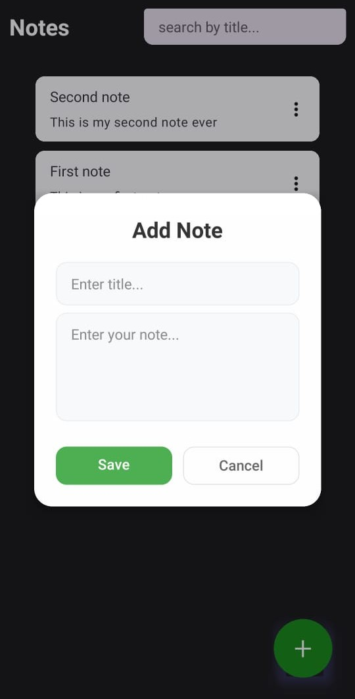

# 📝 Notes V2

A **React Native Notes App** built with [`@react-native-community/cli`](https://github.com/react-native-community/cli).  
Create, manage, and organize notes seamlessly — simple, fast, and cross-platform.  



---

## 🚀 Features

- 📌 Create and manage personal notes  
- 🔄 Real-time updates with Fast Refresh  
- 📱 Cross-platform (Android & iOS)  
- ⚡ Smooth developer experience with Metro bundler  

---

## 🛠️ Getting Started

Before running the app, make sure you have completed the [environment setup](https://reactnative.dev/docs/set-up-your-environment) for React Native.

### 1. Start Metro

```sh
# Using npm
npm start

# OR using Yarn
yarn start
```

2. Run the App
Android
```sh
# Using npm
npm run android

# OR using Yarn
yarn android
```

iOS

Install CocoaPods (first time only): 

```sh
bundle install
bundle exec pod install

```
Then run:
```sh
# Using npm
npm run ios

# OR using Yarn
yarn ios
```
If everything is set up correctly, the app will launch in your Android Emulator, iOS Simulator, or connected device.

---

✏️ Development

Open App.tsx and start coding. Thanks to Fast Refresh, your changes will appear instantly.

To force reload the app:

Android → press R twice or open the Dev Menu (Ctrl+M / Cmd+M)

iOS → press R in the iOS Simulator

---
🧩 Next Steps

📖 Integration Guide
 – add React Native to existing apps

🎓 Learn the Basics
 – a guided tour of React Native basics

📰 React Native Blog
 – stay updated with official news

---

📚 Learn More

React Native Docs
 – official documentation

Environment Setup
 – prepare your machine

@facebook/react-native
 – GitHub repo

 ---

 🎉 Congratulations!

You’ve successfully built and run Notes V2. Now go ahead and make it your own! 🚀
